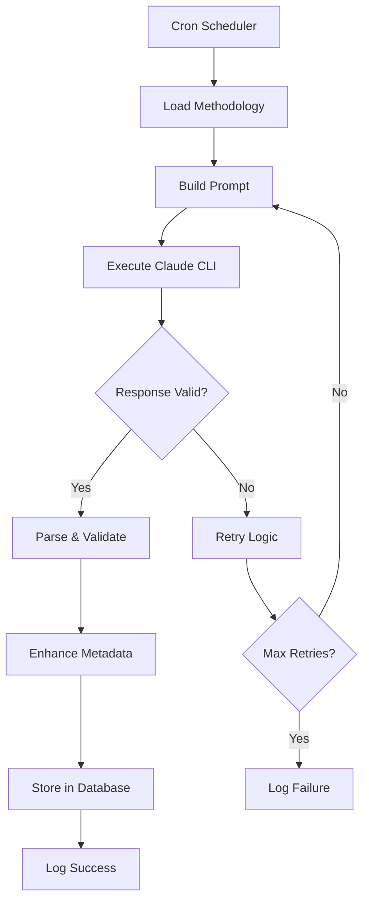
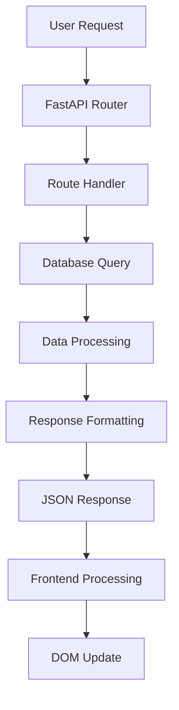

# System Architecture Documentation

## Architecture Overview

Daily Inspo follows a **layered architecture** with clear separation of concerns:

```
┌─────────────────────────────────────────┐
│           Frontend Layer                │
│  (Vanilla JS + HTML/CSS + Responsive)  │
├─────────────────────────────────────────┤
│              API Layer                  │
│           (FastAPI + REST)              │
├─────────────────────────────────────────┤
│            Business Logic               │
│      (Python Services + Models)        │
├─────────────────────────────────────────┤
│             Data Layer                  │
│          (SQLite Database)              │
├─────────────────────────────────────────┤
│           Automation Layer              │
│      (Cron Jobs + Claude CLI)          │
└─────────────────────────────────────────┘
```

## Component Architecture

### 1. Web Application (FastAPI)

**Main Application (`app/main.py`)**
- FastAPI application instance
- Route registration and middleware
- Static file serving
- Template rendering
- Application lifecycle management

**API Routes (`app/api/`)**
- `ideas.py`: Core idea CRUD operations
- `filters.py`: Filter options and validation
- RESTful endpoint design
- JSON response formatting
- Error handling and status codes

**Data Models (`app/models.py`)**
- Pydantic schemas for request/response validation
- Type safety and data validation
- API documentation generation
- Enum definitions for structured data

**Database Layer (`app/database.py`)**
- SQLite connection management
- Query execution and transaction handling
- Data access patterns
- Connection pooling and cleanup

### 2. Database Schema

```sql
-- Core Ideas Table
CREATE TABLE ideas (
    id INTEGER PRIMARY KEY AUTOINCREMENT,
    title TEXT NOT NULL,
    summary TEXT NOT NULL,
    description TEXT NOT NULL,
    supporting_logic TEXT NOT NULL,
    generated_date DATETIME DEFAULT CURRENT_TIMESTAMP,
    created_at DATETIME DEFAULT CURRENT_TIMESTAMP,
    updated_at DATETIME DEFAULT CURRENT_TIMESTAMP
);

-- Tags Table for categorization
CREATE TABLE tags (
    id INTEGER PRIMARY KEY AUTOINCREMENT,
    category TEXT NOT NULL,
    value TEXT NOT NULL,
    UNIQUE(category, value)
);

-- Many-to-many relationship for idea tags
CREATE TABLE idea_tags (
    idea_id INTEGER,
    tag_id INTEGER,
    PRIMARY KEY (idea_id, tag_id),
    FOREIGN KEY (idea_id) REFERENCES ideas (id) ON DELETE CASCADE,
    FOREIGN KEY (tag_id) REFERENCES tags (id) ON DELETE CASCADE
);

-- Market analysis data
CREATE TABLE market_data (
    id INTEGER PRIMARY KEY AUTOINCREMENT,
    idea_id INTEGER UNIQUE,
    market_size TEXT,
    competitors TEXT, -- JSON array stored as text
    technical_feasibility TEXT,
    development_timeline TEXT,
    FOREIGN KEY (idea_id) REFERENCES ideas (id) ON DELETE CASCADE
);

-- Generation logging for monitoring
CREATE TABLE generation_log (
    id INTEGER PRIMARY KEY AUTOINCREMENT,
    timestamp DATETIME DEFAULT CURRENT_TIMESTAMP,
    success BOOLEAN NOT NULL,
    error_message TEXT,
    execution_time_seconds REAL,
    idea_id INTEGER,
    FOREIGN KEY (idea_id) REFERENCES ideas (id)
);

-- Indexes for performance
CREATE INDEX idx_ideas_generated_date ON ideas(generated_date);
CREATE INDEX idx_idea_tags_idea_id ON idea_tags(idea_id);
CREATE INDEX idx_idea_tags_tag_id ON idea_tags(tag_id);
CREATE INDEX idx_tags_category ON tags(category);
CREATE INDEX idx_generation_log_timestamp ON generation_log(timestamp);
```

### 3. Frontend Architecture

**Single Page Application Structure**
```
static/
├── index.html          # Main application shell
├── css/
│   └── styles.css      # Responsive CSS with CSS variables
└── js/
    └── app.js          # Vanilla JavaScript application
```

**Frontend Patterns**
- **Component-like Structure**: JavaScript class with methods for different UI sections
- **Event-Driven Architecture**: DOM event handling with delegation
- **State Management**: Simple object-based state tracking
- **API Communication**: Fetch-based HTTP client with error handling
- **Responsive Design**: Mobile-first CSS with progressive enhancement

### 4. Automation Architecture

**Cron Job System**
```
┌─────────────────┐    ┌──────────────────┐    ┌─────────────────┐
│   Cron Daemon   │───▶│  generate_idea.py │───▶│  Claude CLI     │
│  (10 AM M-F)    │    │   (Main Script)   │    │  (AI Service)   │
└─────────────────┘    └──────────────────┘    └─────────────────┘
                                │
                                ▼
                       ┌──────────────────┐    ┌─────────────────┐
                       │   Response       │───▶│   SQLite DB     │
                       │   Parser         │    │   (Storage)     │
                       └──────────────────┘    └─────────────────┘
```

**Process Flow**
1. **Cron Trigger**: System cron executes Python script weekdays at 10 AM
2. **Environment Setup**: Script validates Claude CLI access and dependencies
3. **Methodology Loading**: Reads idea generation methodology file
4. **Prompt Construction**: Builds comprehensive prompt for Claude
5. **Claude Execution**: Calls Claude CLI with structured prompt
6. **Response Processing**: Parses JSON response and validates structure
7. **Data Enhancement**: Adds metadata and timestamps
8. **Database Storage**: Stores complete idea data with tags and market analysis
9. **Logging**: Records generation attempt success/failure

## Data Flow Architecture

### 1. Idea Generation Flow



### 2. Web Interface Flow



## Technology Stack Justification

### Backend Technologies

**FastAPI**
- **Pros**: High performance, automatic OpenAPI docs, type hints, async support
- **Cons**: Newer ecosystem, fewer third-party packages
- **Chosen Because**: Excellent for rapid prototyping with built-in validation

**SQLite**
- **Pros**: Zero configuration, file-based, ACID compliant, good performance
- **Cons**: Limited concurrent writes, no network access
- **Chosen Because**: Perfect for single-user local development prototype

**Python**
- **Pros**: Rich ecosystem, excellent for automation, readable code
- **Cons**: Performance limitations for high-concurrency
- **Chosen Because**: Ideal for CLI integration and rapid development

### Frontend Technologies

**Vanilla JavaScript**
- **Pros**: No build process, direct browser support, lightweight
- **Cons**: More verbose, no component framework benefits
- **Chosen Because**: Simplicity and avoiding build complexity for prototype

**CSS Variables + Grid/Flexbox**
- **Pros**: Modern responsive design, maintainable styles
- **Cons**: Requires modern browser support
- **Chosen Because**: Clean, maintainable styling without preprocessors

## Security Architecture

### Data Protection
- **SQL Injection Prevention**: Parameterized queries with SQLite
- **Input Validation**: Pydantic models for all API inputs
- **Output Sanitization**: HTML escaping for dynamic content

### System Security
- **File System Access**: Restricted to project directory
- **Process Execution**: Controlled Claude CLI execution with timeouts
- **Error Handling**: No sensitive data in error messages

### Network Security
- **Local Development**: No external network exposure by default
- **API Endpoints**: Input validation and rate limiting ready
- **CORS**: Configurable for future frontend deployment

## Performance Architecture

### Database Optimization
- **Indexing Strategy**: Indexes on commonly filtered fields
- **Query Optimization**: Efficient joins and filtering
- **Connection Management**: Proper connection lifecycle

### Frontend Performance
- **Lazy Loading**: Pagination for large idea sets
- **Efficient Rendering**: Minimal DOM manipulation
- **Caching**: Browser caching for static assets

### Automation Performance
- **Timeout Management**: Bounded execution times
- **Resource Cleanup**: Proper process and connection cleanup
- **Error Recovery**: Graceful failure handling

## Deployment Architecture

### Development Environment
```
Local Machine
├── Python Virtual Environment
├── SQLite Database File
├── FastAPI Development Server
├── System Cron Job
└── Claude CLI Integration
```

### Future Production Considerations
- **Database**: Migrate to PostgreSQL for multi-user support
- **Web Server**: Nginx + Gunicorn for production serving
- **Process Management**: Systemd for service management
- **Monitoring**: Application and system monitoring
- **Backup**: Database backup automation

## Error Handling Strategy

### Generation Script Errors
- **Claude CLI Failures**: Retry with exponential backoff
- **Parsing Errors**: Fallback parsing and validation
- **Database Errors**: Transaction rollback and recovery
- **System Errors**: Comprehensive logging and alerting

### Web Application Errors
- **API Errors**: Structured error responses with appropriate status codes
- **Database Errors**: Graceful degradation with user-friendly messages
- **Validation Errors**: Clear field-level error reporting
- **System Errors**: Generic error responses without sensitive details

## Monitoring & Observability

### Logging Strategy
- **Generation Logs**: Success/failure tracking with timestamps
- **Application Logs**: Structured logging with appropriate levels
- **Error Logs**: Detailed error information for debugging
- **Performance Logs**: Query execution times and response metrics

### Health Monitoring
- **System Status**: Database connectivity and Claude CLI availability
- **Generation Health**: Recent generation success rates
- **Application Health**: API response times and error rates
- **Data Quality**: Idea generation quality metrics

This architecture provides a solid foundation for the Daily Inspo system while maintaining simplicity and focusing on core functionality for the development prototype.